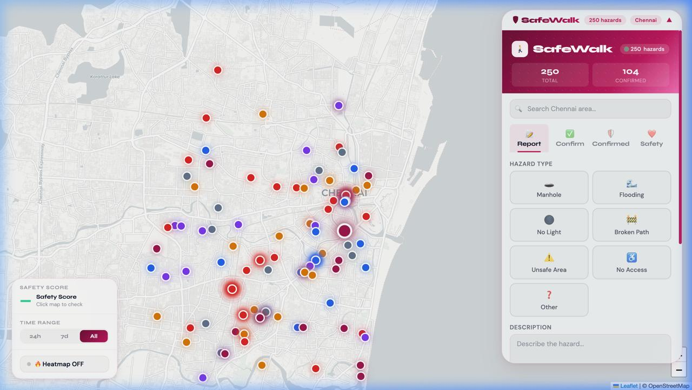
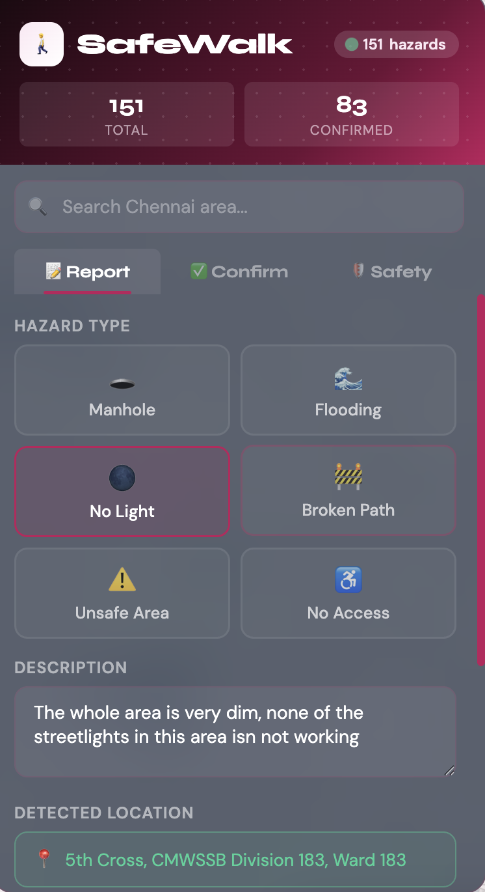
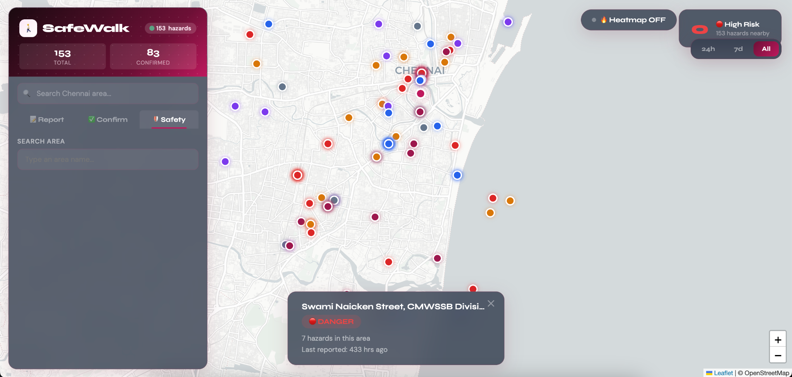
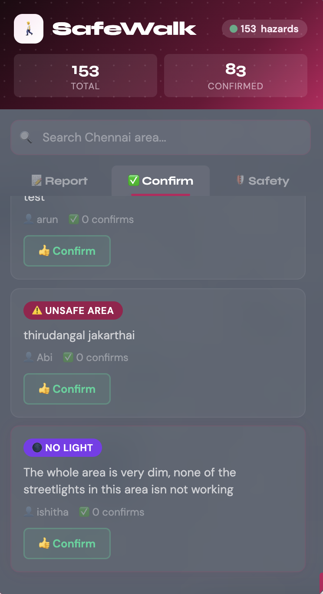
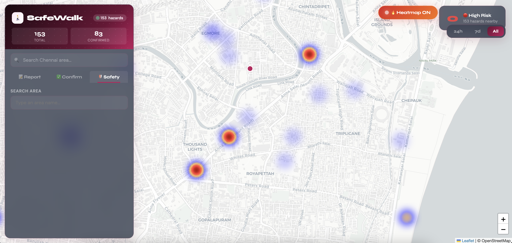
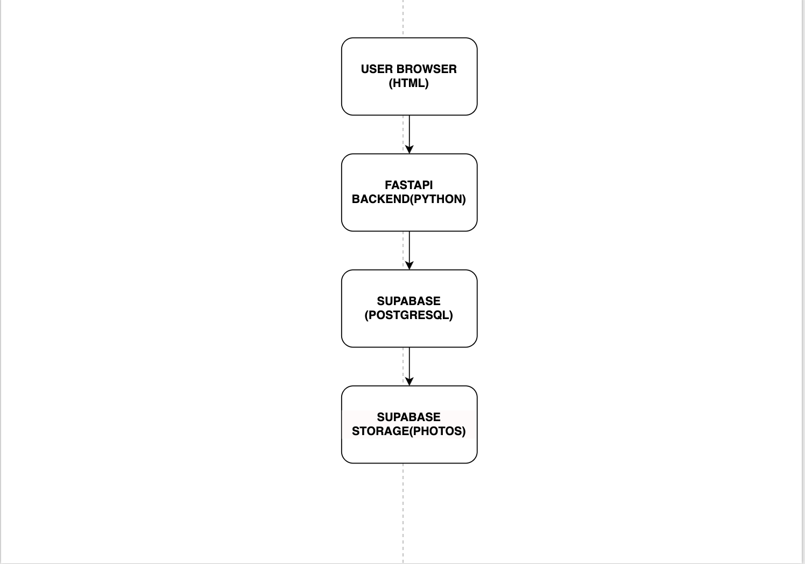

# 🚶 SafeWalk — Making Every Walk Safer
### Crowdsourced Pedestrian Safety Navigation for Indian Cities

[](./LICENSE)
[](https://fossunited.org/fosshack/2026)
[](https://www.openstreetmap.org/)

> **Navigation apps show you the fastest route. SafeWalk shows you the safest one.**

SafeWalk is a crowdsourced map layer that lets users report pedestrian hazards — broken sidewalks, open manholes, flooded streets, poor lighting, and more — with a real-time safety score for any area in Chennai.

Built for Indian cities. Built for everyone who walks.

🌐 **Live App:** https://vishaal1409.github.io/safewalk/
🔌 **Live API:** https://safewalk-95z8.onrender.com/docs

---

## 🎯 The Problem

Every year in cities like Chennai, Mumbai, and Bengaluru, people fall into open drains, get stranded on flooded roads, or are forced to walk through unsafe areas at night. Google Maps will happily route you through a dark, broken-footpath alley — because it doesn't know any better.

**SafeWalk does.**

---

## ✨ Features

| Feature | Description |
|---|---|
| 🕳 **Hazard Reporting** | Report broken footpaths, open manholes, waterlogging, no streetlights, and more |
| 🗺 **Live Hazard Map** | All reports visualised on OpenStreetMap with colour-coded hazard icons |
| 🌟 **Street Safety Score** | Algorithm scores street segments based on nearby hazard density and type |
| ✅ **Community Verification** | Other users confirm reports to improve accuracy |
| 🏅 **Confirmed Tab** | View all community-verified hazards sorted by confirmation count |
| ⏱ **Time Filter** | Filter hazards by last 24h, 7 days, or all time |
| 🔥 **Heatmap Mode** | Visualise danger zones with real-time heat overlay |
| ♿ **Wheelchair Mode** | Routes that avoid steps, broken footpaths, and accessibility blockers |
| 🌊 **Smart Boundaries** | Prevents reporting hazards in the sea |

---

## 🛠 Tech Stack

All tools are 100% open source.

| Layer | Technology |
|---|---|
| Frontend | HTML · CSS · JavaScript · Tailwind CSS |
| Map | Leaflet.js · OpenStreetMap |
| Backend | Python · FastAPI · Uvicorn |
| Database | PostgreSQL via Supabase |
| Storage | Supabase Storage (hazard photos) |
| Auth | JWT tokens · Passlib · bcrypt |
| Mobile (planned) | Flutter |
| Deployment | GitHub Pages (frontend) · Railway / Render (backend) |
| Containerisation | Docker · docker-compose |

---

## 🚀 Quick Start

### Option 1 — Use the live app (no setup needed!)
Just open: **https://vishaal1409.github.io/safewalk/**

### Option 2 — Run locally

**Prerequisites:** Python 3.x, Git
```bash
# 1. Clone the repo
git clone https://github.com/Vishaal1409/safewalk.git
cd safewalk

# 2. Create virtual environment
python -m venv .venv

# Windows (Command Prompt / PowerShell)
.venv\Scripts\activate

# Mac/Linux
source .venv/bin/activate

# 3. Install backend dependencies
cd backend
pip install -r requirements.txt
cd ..

# 4. Install frontend dependencies
pip install -r frontend/requirements.txt

# 5. Run the backend
cd backend
uvicorn src.main:app --reload

# 6. In a new terminal, run the frontend
cd frontend
python -m http.server 3000
```

The API runs on `http://localhost:8000` and the frontend is available at `http://localhost:3000`.

---

## 📁 Project Structure
```
safewalk/
├── backend/
│   ├── src/
│   │   ├── main.py           # FastAPI app + all endpoints
│   │   ├── routes/
│   │   │   └── auth.py       # JWT login/register
│   │   └── services/
│   │       ├── safety_score.py   # Safety scoring algorithm
│   │       └── route_engine.py   # Haversine route comparison
│   ├── test/                 # Test scripts
│   ├── Dockerfile
│   └── requirements.txt
├── frontend/
│   └── index.html            # Full frontend (map, report, confirm, safety)
├── docs/
│   ├── api/                  # API documentation
│   ├── design/               # Figma design notes
│   └── screenshots/          # App screenshots
├── index.html                # Root copy for GitHub Pages
├── .env.example
├── .gitignore
├── docker-compose.yml
├── LICENSE
└── README.md
```

---

## 📸 Screenshots

| Map View | Report Form | Safety Score | Confirmed Tab |
|---|---|---|---|
|  |  |  |  |

> 🔥 **Heatmap Mode**
> 

---

## 🏗 Architecture



---

## 🎬 Demo Video

> 📺 [YouTube link coming soon] — full walkthrough of hazard reporting, map view, and safety scoring.

---

## 🔌 API Endpoints

| Method | Endpoint | Description |
|---|---|---|
| GET | `/` | Health check |
| GET | `/hazards` | Fetch all hazards |
| POST | `/hazards` | Report a new hazard |
| POST | `/hazards/{id}/confirm` | Community confirm a hazard |
| GET | `/safety-score` | Get safety score for a location |
| POST | `/auth/register` | Register a new user |
| POST | `/auth/login` | Login and get JWT token |

Full API docs: https://safewalk-95z8.onrender.com/docs

---

## 🗺 How It Works

1. **A user spots a hazard** (e.g. open manhole on Velachery Main Rd, Chennai)
2. **They open SafeWalk**, tap the location on the map, select hazard type, optionally upload a photo, and submit
3. **The hazard appears on the community map** instantly with a coloured marker
4. **Other users walking nearby see the hazard icon** and are warned
5. **Community members confirm the report** — confirmed reports get higher weight in the safety algorithm
6. **The safety score** for any area updates in real time based on nearby hazards

---

## 🧮 Safety Score Algorithm

Each area gets a score (0–100, higher = safer) based on:

- Number of active hazard reports within the radius
- Hazard severity weights (open manhole > broken footpath)
- Report recency (newer = higher weight)
- Community confirmation count
- Time of day (lighting hazards weighted higher at night)

---

## 🤝 Contributing

This is a FOSS Hack 2026 project. Contributions, issues, and feature requests are welcome!

1. Fork the repo
2. Create your branch: `git checkout -b feat/your-feature`
3. Commit your changes: `git commit -m 'feat: add your feature'`
4. Push and open a PR

---

## 👥 Team — Random Forest Rangers 🌲

| Name | Role |
|---|---|
| Vishaal S | Backend, Database & Safety Algorithm |
| Arun Balaji | Backend, Documentation & Project Manager |
| Shruthika Nair | Frontend & Map Interface |
| Ishitha Ilan | UI/UX Design & Accessibility |

---

## 📄 License

This project is licensed under the **MIT License** — see the [LICENSE](./LICENSE) file for details.

---

## 🙏 Acknowledgements

- [OpenStreetMap](https://www.openstreetmap.org/) contributors
- [Leaflet.js](https://leafletjs.com/) — open-source map library
- [FastAPI](https://fastapi.tiangolo.com/) — modern Python API framework
- [Supabase](https://supabase.com/) — open-source Firebase alternative
- [Render](https://render.com/) — cloud deployment platform
- [FOSS United](https://fossunited.org/) for organising FOSS Hack 2026

---

<p align="center">Made with ❤️ for safer streets in India • Random Forest Rangers 🌲</p>